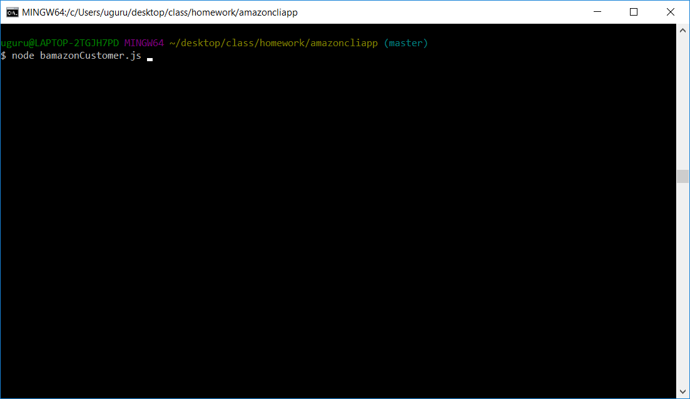
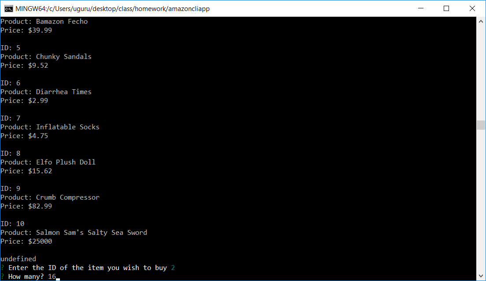
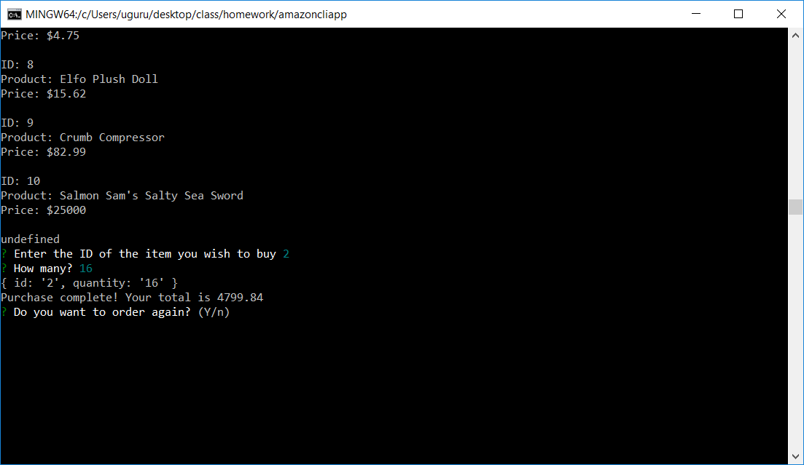
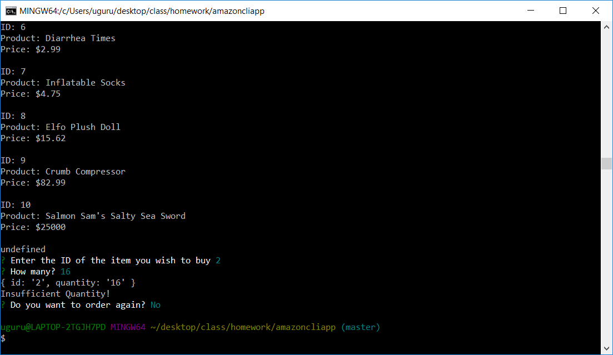

### amazoncliapp
homework for mysql section

## Necessary Files To Begin
To run the application you'll need

- A .env file
    - Inside should be your username for the server
- An SQL server to connect to
- (Preferably the one provided) or your own database/schema
    - Example data will be provided!
    - Make sure to look at the [MySQL Folder](mysql+schema)

## Commands (with Screenshots)
;

To start the application you'll have to type into the bash console `node bamazonCustomer`.

;

Here you'll see a list of items that have been stored into the database. A schema has been provided in the repo for you to use! 

You will be prompted to enter the ID number. This is going to be one of the IDs listed in your console. Pick a valid ID number and enter the amount you want to purchase!

;

If your purchase is successful, it will display the total amount in your console and ask if you'd like to purchase more or if you're done.

Saying "Yes" will restart the beginning and display all the items and restart the prompt to enter an ID and amount.

;

If your purchase cannot be made, your console will display "Insufficent Quantity!" and you will be asked if you'd like to make another purchase. 

Saying "No" will end the connection with your server.
